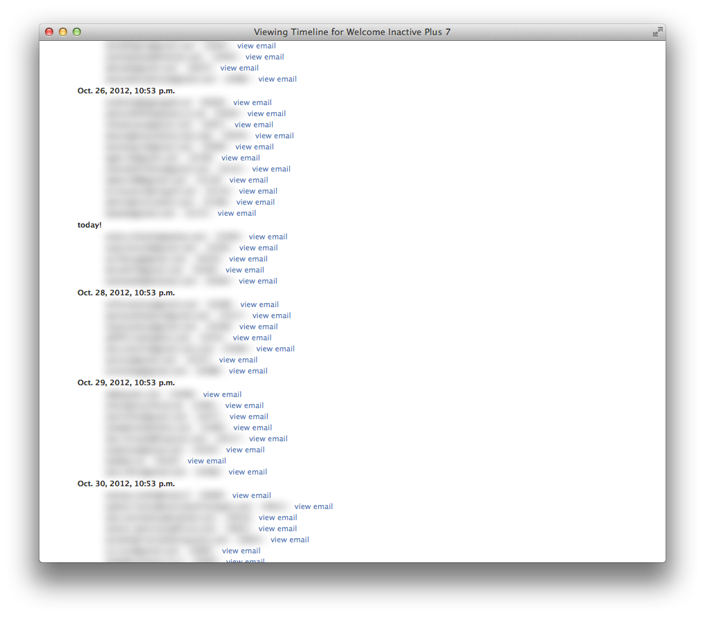

.. Django Drip documentation master file, created by
   sphinx-quickstart on Sat Oct 27 18:42:11 2012.
   You can adapt this file completely to your liking, but it should at least
   contain the root `toctree` directive.

Welcome to Django Drip's documentation!
=======================================

Django Drip is a simple app for creating drip campaigns for email using Django's admin interface and a User queryset. It lets you dynamically build querysets and templates. Back in the day, you might write the code directly below to perform the task:

.. code-block:: python

    from datetime import datetime, timedelta
    now = datetime.now()
    from django.contrib.auth.models import User
    from django.core.mail import EmailMessage
    from django.template import Context, Template

    # get users who joined one week ago and have more than 25 credits on their profile
    # (credits are an arbitrary example, you can imagine placing your own criteria here...)
    users = User.objects.filter(date_joined__gte=now-timedelta(days=7),
                                date_joined__lt=now-timedelta(days=6),
                                profile__credits__gt=25)

    # define the email template we want to send
    subject_template = 'Thanks {{ user.username }}!'
    body_template = 'We appreciate you buying {{ user.profile.credits }} credits! Please buy more!'

    # render and send the email
    for user in users:
        subject = Template(subject_template).render(Context({'user': user}))
        body = Template(body_template).render(Context({'user': user}))

        msg = EmailMessage(subject, body, 'me@example.com', [user.email])
        msg.send()

However, instead of writing and modifying code each and everytime you want to add a new drip to the campaign or edit the copy, you can simply edit the records listed in the admin interface. Plus, Django Drip also handles deduplication, making sure the same user never gets an email for the same drip compaign twice. 

The admin equivalent for the code above is pictured below:

.. image:: images/drip-example.png
   :width: 100 %
   :alt: the above code example, in the admin!

But the killer feature is the ability to view emails *expected* to be sent, by clicking the "View Timeline" link in the top right when editing a drip:

Now you can just set up a cronjob to send drips daily (you could also do hourly, or weekly, depends on your use case).

.. code-block:: bash
    
    python manage.py send_drips

Installing:
----------

We highly recommend using pip to install *django-drip*, the packages are regularly updated 
with stable releases:

.. code-block:: bash

   pip install django-drip

Next, you'll want to add ``drip`` to your ``INSTALLED_APPS`` in settings.py.

..  code-block:: python

    INSTALLED_APPS = (
        'django.contrib.contenttypes',
        'django.contrib.comments',
        'django.contrib.sessions',
        'django.contrib.sites',
        'django.contrib.admin',

        # Your favorite apps

        'drip',
    )

Don't forget to add ``DRIP_FROM_EMAIL`` to settings.py, or else we will fall back to ``EMAIL_HOST_USER``.

Finally, be sure to run ``python manage.py syncdb`` or ``python manage.py migrate drip`` to set up
the necessary database tables.

.. code-block:: bash

   python manage.py syncdb
   # or...
   python manage.py migrate drip

Custom Message Classes
----------------------

By default, Django Drip creates and sends messages that are instances of Django's ``EmailMultiAlternatives`` class.
(The plain-text version of the email is generated by stripping HTML tags from the rendered body template.)
This email generation and creaton of the ``EmailMultiAlternatives`` instance that will be sent is done by the
``drip.drips.EmailMessage`` class. If you have a need to customize in any way the message that is created and sent,
you can do that by creating a subclass of ``drip.drips.EmailMessage`` and overriding any method(s) that you need to
behave differently than they do by default. For example:

.. code-block:: python

   from django.core.mail import EmailMessage
   from drip.drips import DripMessage

   class PlainDripEmail(DripMessage):

       @property
       def message(self):
           if not self._message:
               email = EmailMessage(self.subject, self.plain, self.from_email, [self.user.email])
               self._message = email
           return self._message

Here, ``PlainDripEmail`` overrides the ``message`` property of the base ``DripMessage`` class to create a simple
``EmailMessage`` instance instead of an ``EmailMultiAlternatives`` instance. Note the value for the ``message``
property can be anything that has a ``send`` method that returns a True/False indication of whether the message was
actually sent. Also, other properties of ``DripMessage`` may be overridden to change the way in which the Drip's
information is used to generate the message subject, plain text, etc.

In order to be able to specify that your custom message class should be used for a drip, you need to configure it via
the ``DRIP_MESSAGE_CLASSES`` setting. For example:

.. code-block:: python

   DRIP_MESSAGE_CLASSES = {
       'plain': 'proj.email.PlainDripEmail',
   }

This setting will allow for choosing in the admin, for each drip, whether the "default" (``drip.drips.Dripmessage``)
or "plain" message class should be used for generating and sending the messages to users that meet the drip criteria.
Note there is an "default" key mapped to the default ``DripMessage`` class that is added to the settings-configured
``DRIP_MESSAGE_CLASSES`` dictionary if that value does not have a "default" key. If you wish to use a custom class for
all drips, simply specify that custom class as the "default" key value in the settings, for example:

.. code-block:: python

   DRIP_MESSAGE_CLASSES = {
       'default': 'proj.email.PlainDripEmail',
   }

Development:
------------

First, clone the repository:

.. code-block:: bash

   git clone git@github.com:zapier/django-drip.git django-drip
   cd django-drip

Next, create the virtualenv and populate it:

.. code-block:: bash

   mkvirtualenv djangodrip
   pip install -r requirements.txt

Finally, run the tests:

.. code-block:: bash

   ./manage.py test drip

You can, of course, build the sphinx docs as well:

.. code-block:: bash

   cd docs
   make html

Find the built docs in ``_build/html``.
